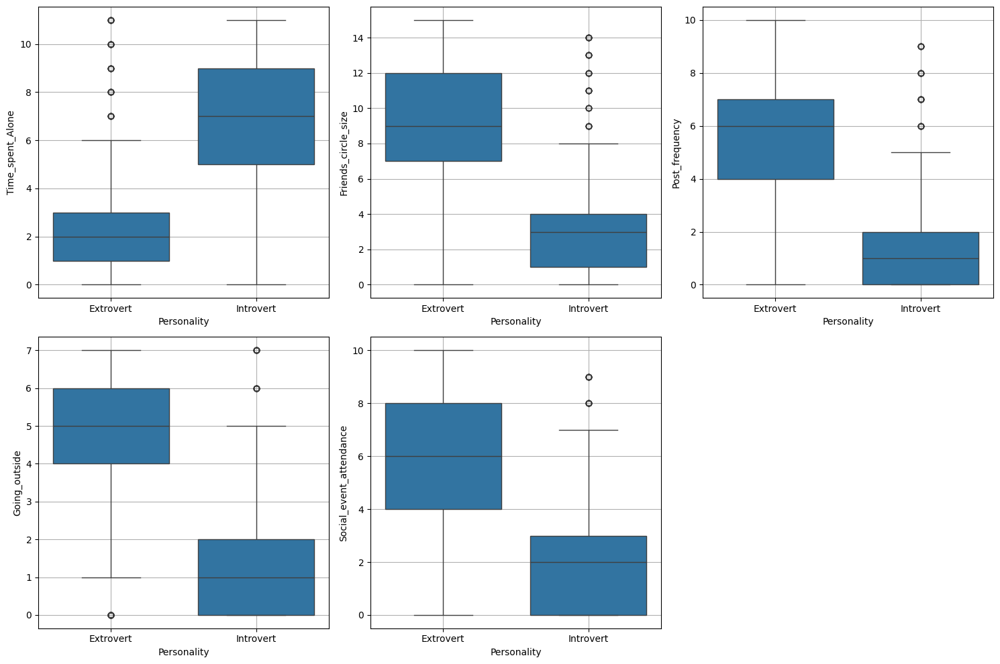
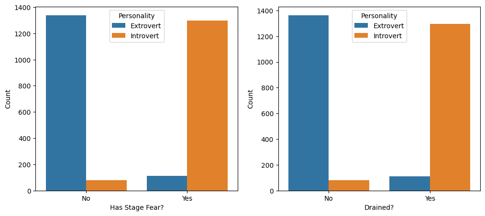
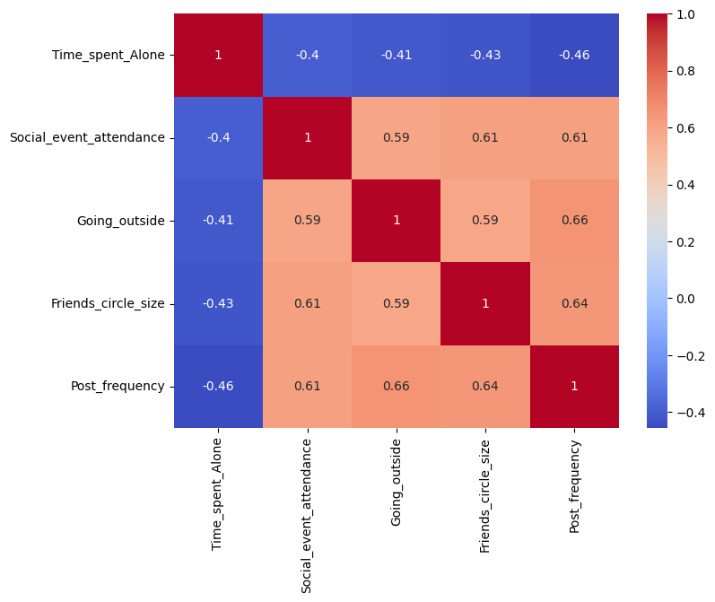
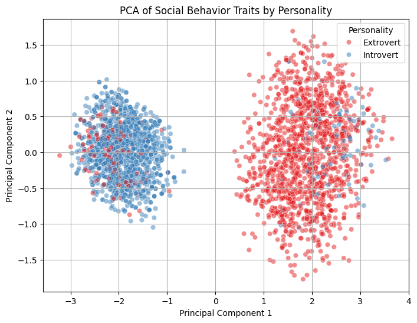
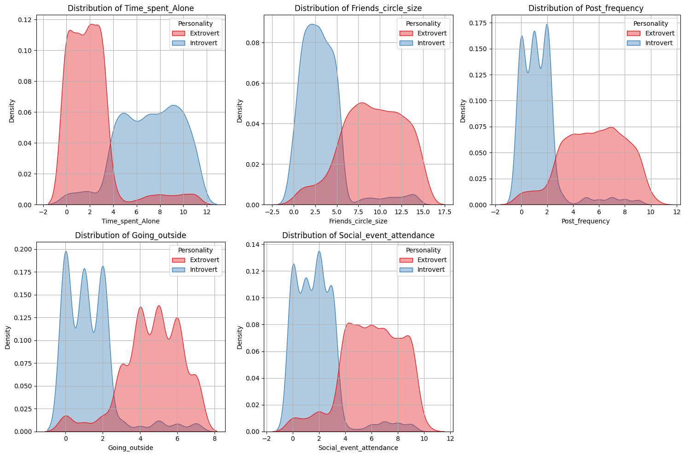

# Exploratory Data Analysis of Social Behavior in Introverts and Extroverts

## Introduction
This project analyzes how personality types (**Introvert vs Extrovert**) relate to various social behavior metrics using **exploratory data analysis (EDA)** and visualization. By comparing distributions, applying **PCA**, and summarizing patterns, we uncover how these different personality types differ in:

- Time spent alone
- Social event attendance
- Going outside frequency
- Friends circle size
- Posting frequency
- Stage fear and social energy drain

---

## Dataset Overview

**Shape:** 2,900 rows × 8 columns

**Columns**
- `Time_spent_Alone` (float)
- `Stage_fear` (object: Yes/No)
- `Social_event_attendance` (float)
- `Going_outside` (float)
- `Drained_after_socializing` (object: Yes/No)
- `Friends_circle_size` (float)
- `Post_frequency` (float)
- `Personality` (object: Introvert/Extrovert)

**Non-Null Counts & Dtypes**

| # | Column                     | Non-Null Count | Dtype   |
|---|----------------------------|----------------|---------|
| 0 | Time_spent_Alone           | 2837           | float64 |
| 1 | Stage_fear                 | 2827           | object  |
| 2 | Social_event_attendance    | 2838           | float64 |
| 3 | Going_outside              | 2834           | float64 |
| 4 | Drained_after_socializing  | 2848           | object  |
| 5 | Friends_circle_size        | 2823           | float64 |
| 6 | Post_frequency             | 2835           | float64 |
| 7 | Personality                | 2900           | object  |

**Descriptive Statistics (Numerical)**

|                         | Time_spent_Alone | Social_event_attendance | Going_outside | Friends_circle_size | Post_frequency |
|-------------------------|-----------------:|------------------------:|--------------:|--------------------:|---------------:|
| **count**               | 2837.000000      | 2838.000000             | 2834.000000   | 2823.000000         | 2835.000000    |
| **mean**                | 4.505816         | 3.963354                | 3.000000      | 6.268863            | 3.564727       |
| **std**                 | 3.479192         | 2.903827                | 2.247327      | 4.289693            | 2.926582       |
| **min**                 | 0.000000         | 0.000000                | 0.000000      | 0.000000            | 0.000000       |
| **25%**                 | 2.000000         | 2.000000                | 1.000000      | 3.000000            | 1.000000       |
| **50%**                 | 4.000000         | 3.000000                | 3.000000      | 5.000000            | 3.000000       |
| **75%**                 | 8.000000         | 6.000000                | 5.000000      | 10.000000           | 6.000000       |
| **max**                 | 11.000000        | 10.000000               | 7.000000      | 15.000000           | 10.000000      |

**Value Counts (Categorical)**

| Stage_fear | Count |
|------------|------:|
| No         | 1417  |
| Yes        | 1410  |

| Drained_after_socializing | Count |
|---------------------------|------:|
| No                        | 1441  |
| Yes                       | 1407  |

| Personality | Count |
|-------------|------:|
| Extrovert   | 1491  |
| Introvert   | 1409  |

**Missing Values**

| Column                     | Missing |
|---------------------------|--------:|
| Time_spent_Alone          | 63      |
| Stage_fear                | 73      |
| Social_event_attendance   | 62      |
| Going_outside             | 66      |
| Drained_after_socializing | 52      |
| Friends_circle_size       | 77      |
| Post_frequency            | 65      |
| Personality               | 0       |

---

## Visual Analyses

### Box Plots: Numeric Features vs Personality


**Box-Plot Insights**

| Feature                     | Extrovert (median · IQR) | Introvert (median · IQR) | Visual takeaway |
|----------------------------|--------------------------|---------------------------|-----------------|
| **Time_spent_Alone**       | ~2 hrs · narrow (0–3)    | ~7 hrs · wide (5–9)       | Introverts spend much more solo time; strong separation. |
| **Social_event_attendance**| ~6 events · tight        | ~2 events · tight         | Extroverts attend ~3× more events. |
| **Going_outside**          | Median ≈ 5 trips         | Median ≈ 1 trip           | Sharp discriminator between groups. |
| **Friends_circle_size**    | ≈ 8–10 friends           | ≈ 3–4 friends             | Larger networks among extroverts. |
| **Post_frequency**         | ≈ 6–7 posts              | ≈ 1–2 posts               | Online activity mirrors offline sociability. |

**Key takeaways**
- **Distinct lifestyles:** Minimal overlap in Time_spent_Alone, Friends_circle_size, Post_frequency.
- **Inverse pattern:** More time alone ↔ fewer events.
- **Going_outside** appears to be the **strongest single-variable separator**.

---

### Categorical Social Traits


**Observations**
- **Stage Fear:** More common among introverts; extroverts predominantly “No”.
- **Drained After Socializing:** Many introverts report feeling drained; extroverts mostly do not—consistent with energy sources differing by personality.

---

### Correlations (Introverts Only)


**Highlights**
- **Time_spent_Alone** shows **moderate negative correlations** with:
  - Social_event_attendance (**≈ −0.40**)
  - Going_outside (**≈ −0.41**)
  - Friends_circle_size (**≈ −0.43**)
  - Post_frequency (**≈ −0.46**)
- **Post_frequency** shows **strong positive correlations** with:
  - Going_outside (**≈ 0.66**)
  - Friends_circle_size (**≈ 0.64**)
  - Social_event_attendance (**≈ 0.61**)

**Interpretation:** More time alone associates with lower social activity across the board; socially active individuals tend to be active both offline and online.

---

### PCA of Social Behavior Traits by Personality


**Explained Variance Ratio**
- **PC1:** 0.79167684
- **PC2:** 0.05903091
- **Total (PC1 + PC2):** ~0.8507

**Loadings**

| Feature                    | PC1       | PC2       |
|---------------------------|-----------|-----------|
| Time_spent_Alone          | -0.444575 | 0.242704  |
| Social_event_attendance   | 0.448833  | 0.104585  |
| Going_outside             | 0.453799  | -0.203907 |
| Friends_circle_size       | 0.440762  | 0.820294  |
| Post_frequency            | 0.447993  | -0.464432 |

**Interpretation**
- **PC1: Social Engagement Axis (79.2%)**
  - Negative = introversion (more alone time)
  - Positive = extroversion (more events, outside, posting, larger circles)
- **PC2: Online–Offline Duality (5.9%)**
  - Positive = offline-focused (large networks, lower posting)
  - Negative = online-focused (higher posting, smaller circles)

**Key insight:** PC1 cleanly separates introverts (left) vs extroverts (right), with **Going_outside** and **Social_event_attendance** among the strongest positive contributors.

---

### KDE Distributions of Traits by Personality


**Summary Table**

| Feature                     | Extrovert Pattern                               | Introvert Pattern                                   | Observation |
|----------------------------|--------------------------------------------------|-----------------------------------------------------|-------------|
| **Time_spent_Alone**       | Unimodal, sharp low-value peak                   | Bimodal (low and high)                              | Introverts show a subgroup with very high alone time. |
| **Friends_circle_size**    | Right-skewed, larger networks                    | Left-skewed, smaller networks                        | Network size is a strong differentiator. |
| **Post_frequency**         | Unimodal, moderate                               | Broader spread; many active online                   | Digital socializing may be preferred by some introverts. |
| **Going_outside**          | Tall peak at high frequency                      | Broad peak around moderate                           | Extroverts go out more frequently. |
| **Social_event_attendance**| Right-skewed, frequent attendance                | Left-skewed, rare attendance                         | Strong attendance gap. |

**General Insights**
- **Extroverts**: dense concentration of high social activity.
- **Introverts**: greater variability, especially in alone time and online activity.

---

### Conclusion

Through a comprehensive exploratory data analysis (EDA) of the Extrovert vs Introvert Behavior Dataset, we observed and uncovered patterns in how personality types correlate with social behaviors. Key takeaways include:
Introverts tend to spend more time alone, attend fewer social events, and have smaller social circles.
Extroverts, on the other hand, are more socially active, attend more events, and typically have more friends.
Categorical traits like Stage Fear and Feeling Drained after Socializing show a strong contrast between the two groups, aligning with psychological expectations.
The Principal Component Analysis (PCA) demonstrated a clear separation between the two personalities along a social engagement axis.
The correlation heatmap revealed that variables such as social event attendance, post frequency, and going outside are positively correlated, while time spent alone shows a consistent negative correlation with these behaviors.
These patterns and findings support existing understanding and theories in psychology regarding introversion and extroversion.

## Installation

```bash
git clone https://github.com/your-username/EDA-SocialBehavior.git
cd EDA-SocialBehavior
pip install -r requirements.txt

# Requirements

Python 3.8+
pandas
matplotlib
seaborn
jupyter (if running the notebook)

Usage
Run the notebook
jupyter notebook analysis.ipynb
```
